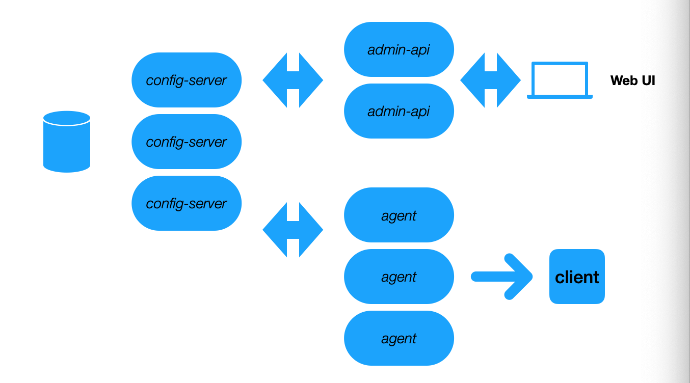

# gcc-zero
基于go-zero框架编写的配置中心

## 功能
- Web UI 实现对配置 CRUD
- agent client 实时读取配置，加载至本地或者内存
- 配置存储于 ETCD
- 可手动下发配置到机器
- 可查看历史变更
- 基于 go-zero 开发微服务体系

## 目录拆分
参考详见 https://go-zero.dev/cn/service-design.html

## 架构图
